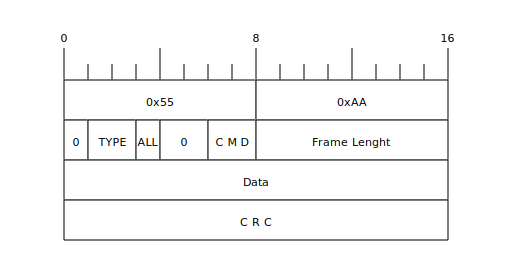
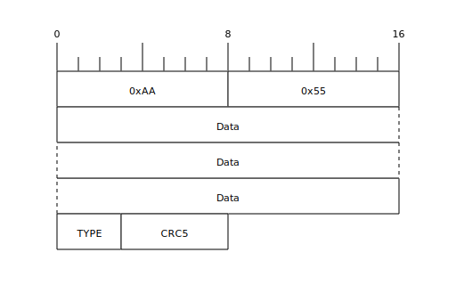
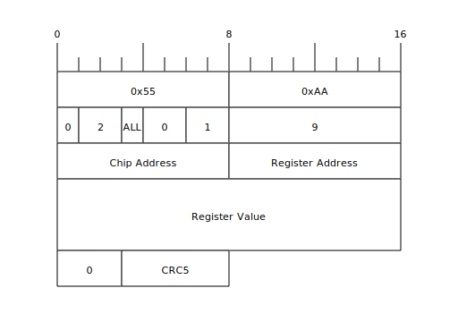
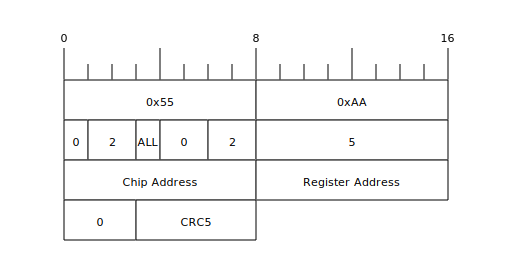
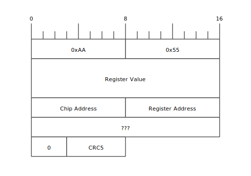
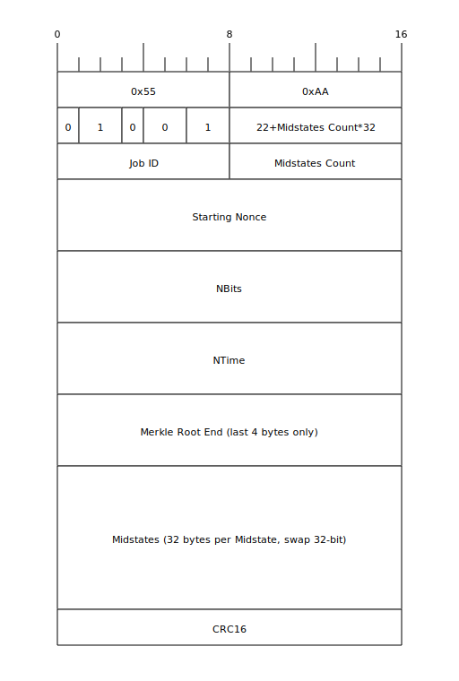
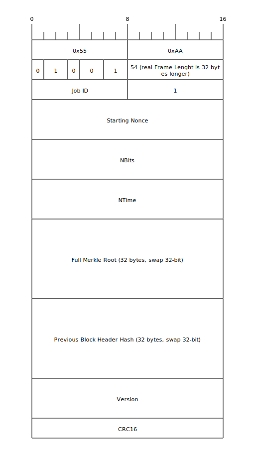
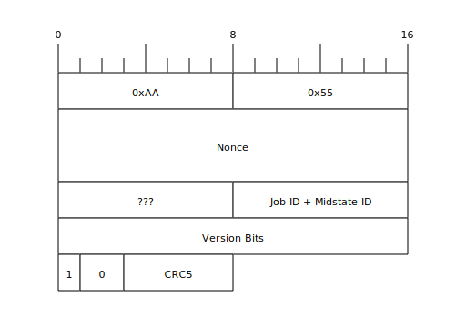

# Protocol
<!-- cspell:disable-next-line -->
NRSTI (**N**egated **R**e**S**e**T** **I**nput) does a hardware reset on BM1366 when signal is Low.

<!-- cspell:disable-next-line -->
CLKI (**CL**oc**K** **I**nput) pin must have a 25MHz clock signal, it will be propagated to the CLKO (**CL**oc**K** **O**utput) pin.

<!-- cspell:disable-next-line -->
BI (**B**usy **I**nput) signal must be pulled-down in order to let the BM1366 communicate.

<!-- cspell:disable-next-line -->
Communication with BM1366 is done by UART on its CI (**C**command **I**nput) pin and RO (**R**esponse **O**utput). Default baudrate is 115200 bps. UART has 8 bits of data, no parity, 1 stop bit (usually represented as 115200 8N1).

## Command

### Preamble

All commands have a fixed 2 byte preamble: 0x55 0xAA

### TYPE

* TYPE = 1: send Job
* TYPE = 2: send Command

### ALL

* ALL = 0: send to a single Chip
* ALL = 1: send to all Chips on the Chain

### CMD

if TYPE == 1:

* CMD = 1: send Job

if TYPE == 2:

* CMD = 0: set Chip Address
* CMD = 1: write Register
* CMD = 2: read Register
* CMD = 3: chain Inactive

### Frame Length

Total Frame Length excluding preamble.

### Data

Depends on TYPE/CMD, see detailed frames below.

### CRC

Can be CRC5 or CRC16 depending on TYPE/CMD, see detailed frames below.

## Response

All Responses have fixed length : 9 bytes.

### Preamble

All commands have a fixed 2 byte preamble: 0xAA 0x55

### TYPE

* TYPE = 0: respond to a command
* TYPE = 4: respond to a job (nonce)

### Data

Depends on TYPE, see detailed frames below.

### CRC5

CRC 5 bits with polynomial 0x05, initial value 0x1F, no reflection, no final XOR of the full Frame excluding preamble.

## Set Chip Address

On reset, all chips have a logical address of 0. In order to access to a specific chip later, we must give them different addresses.

**Warning**: Chip Address is different from chip index on the chain. It is a logical concept configurable by software.

To set Chip Address of all chips one by one, we **must not** send commands to ALL chips, just to the chip with Address = 0, so the first chip on the chain will get the command and not propagate it downward.

The Set Chip Address Command format is:

No Response is returned by the chip.

## Write Register

The Write Register Command format is:

No Response is returned by the chip.

## Read Register

The Read Register Command format is:

Sending a Read Register Command to ALL chips on the chain is very useful to enumerate them (usually with the [Chip Address](bm1366_registers.md#chip-address) register), every chip on the chain will send a Response that will be propagated upward.

## Register Value

The Register Value Response format is:

Warning: sometimes a Register Value can be sent spontaneously by a chip (usually the [Core Register Value](bm1366_registers.md#core-register-value) register).

### 2 Extra Bytes

Only present if Version Rolling has been Enabled in [Version Rolling](bm1366_registers#version-rolling) Register.

## Chain Inactive

The Chain Inactive Command format is:

No Response is returned by the chip.

## Send Job

The Send Job Command has 2 formats, depending on [MID_AUTO_GEN](bm1366_registers.md#mid_auto_gen) bit in [Version Rolling](bm1366_registers.md#version-rolling) register:

### Midstates Format

### Full Header Format

## Nonce

Once hashing, when a nonce is found by a chip on the chain, it is sent on the RO pin (and propagated upward) with this format:

### Version Bits

Only present if Version Rolling has been Enabled in [Version Rolling](bm1366_registers#version-rolling) Register.
