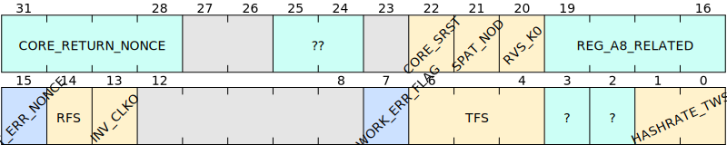

# BM1366 Registers map

## Chip Address

Address = 0x00

Reset value = 0x1366_0000

### CHIP_ID

On BM1366, CHIP_ID = 0x1366

### CORE_NUM

On BM1366, CORE_NUM = 0x00 which is not relevant, the actual Core Number is 894.

### ADDR

This is the Chip Address of the particular chip, see [Set Chip Address](bm1366_protocol.md#set-chip-address) for details.

## Misc Control

Address = 0x18

Reset value = 0x0000_C100

### RFS (RF pin Selector)

* RFS = 0: Open Drain
* RFS = 1: SDA0

### TFS (TF pin Selector)

* TFS = 0: Hash Doing
* TFS = 1: UART RX
* TFS = 2: UART TX
* TFS = 3: SCL0

## Fast UART Configuration

Address = 0x28

Reset value = 0x0130_1A00

### BT8D

It is a 8-bit divider to determine actual Baudrate.

### BCLK_SEL
<!-- cspell:disable-next-line -->
**B**audrate **CL**oc**K** **SEL**ect

* BCLK_SEL = 0: Baudrate base clock is CLKI (external clock)
* BCLK_SEL = 1: Baudrate base clock is PLL1

## PLL1 Parameter

Address = 0x60

Reset value = 0x2050_0174

PLL1 frequency is calculated with the formula :

`
fPLL1 = fCLKI * FBDIV / (REFDIV * POSTDIV1 * POSTDIV2)
`
POSTDIV1 must be greater than or equal to POSTDIV2.

## Version Rolling

Address = 0xA4

Reset value = 0x0000_FFFF

### EN

This bit enable the Version Rolling feature.

* Subsequent [Send Job](bm1366_protocol.md#send-job) Command should have the [Full Header Format](bm1366_protocol.md#full-header-format).
* Subsequent [Register Value](bm1366_protocol.md#register-value) Response from BM1366 will have [2 extra bytes](bm1366_protocol#2-extra-bytes).
* Subsequent [Nonce](bm1366_protocol.md#nonce) from BM1366 will have [Version Bits](bm1366_protocol#version-bits).

### VERSION_MASK

This is a 16-bit mask to apply on the Version[28:16] of the block candidate header (0x1FFE0000).

## Reg_A8

Address = 0xA8

Reset value = 0x0007_0000

