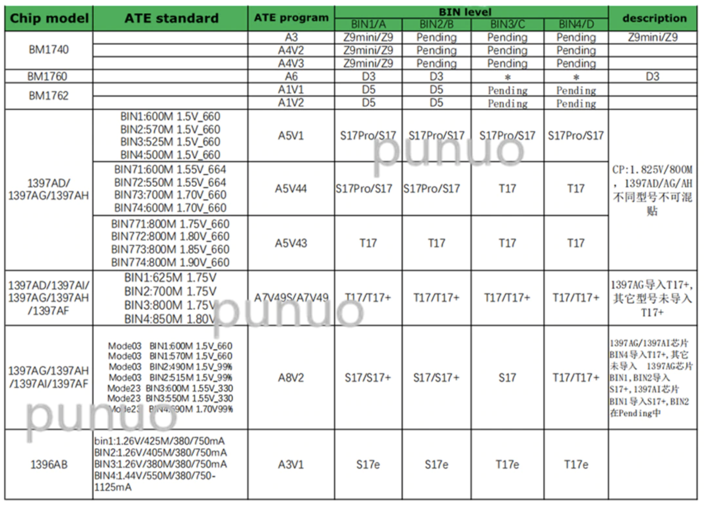

# Doc Project

# BM1397

The BM1397 is a SHA256 bitcoin mining ASIC from Bitmain. The BM1397 is mostly undocumented. This repo aims to fix that.

## Usage

## Variants

Really don’t know what this table means, but it mentions a lot of variants of the BM1397

| Variant | Used In | Notes |
| --- | --- | --- |
| BM1397AD | S17, S17 Pro, T17 | original model of Bitmain’s BM1397 design |
| BM1397AG | S17, S17 Pro, T17, S17+, T17+ | revision allows greater resilience at high temperatures |
| BM1397AH | S17, S17 Pro, T17 | tend to have stable hashrate even when the voltage is insufficient |
| BM1397AI | all | fits all models. signal clarity, backward compatibility and significantly increased stability; better performance |
| BM1397AF | S17, S17+, T17, T17+ | ?? |

## Recommended Operating Conditions

## Pin Configurations and Functions

### Pin Functions

| Mode 0 Pin Number | Mode 1 Pin Number | Pin Name | Description |
| --- | --- | --- | --- |
| 1 | 1 | VDD3_0 |  |
| 2 | 2 | VDD2_0 |  |
| 3 | 3 | VDD1_0 |  |
| 4 | 4 | ADDR0 |  |
| 5 | 5 | ADDR1 |  |
| 6 | 6 | ADDR2 |  |
| 7 | 7 | TEST |  |
| 8 | 25 | CLKO |  |
| 9 | 26 | CO |  |
| 10 | 27 | RI |  |
| 11 | 28 | NRSTO |  |
| 12 | 29 | BO |  |
| 13 | 13 | PLL_VSS |  |
| 14 | 14 | PLL_VDD |  |
| 15 | 15 | VDDIO08_0 |  |
| 16 | 16 | VDDIO18_0 |  |
| 17 | 17 | VDDIO18_1 |  |
| 18 | 18 | VDDIO08_1 |  |
| 19 | 19 | VSS |  |
| 20 | 20 | PIN_MODE |  |
| 21 | 21 | TEMP_N |  |
| 22 | 22 | TEMP_P |  |
| 23 | 23 | RF |  |
| 24 | 24 | TF |  |
| 25 | 8 | BI |  |
| 26 | 9 | NRSTI |  |
| 27 | 10 | RO |  |
| 28 | 11 | CI |  |
| 29 | 12 | CLKI |  |
| 30 | 30 | VDD1_1 |  |
| 31 | 31 | VDD2_1 |  |
| 32 | 32 | VDD3_1 |  |
| 33 | 33 | VDD |  |
| 34 | 34 | VSS |  |

### Modes

## Programing Manual
- [BM1397](bm1397.md)
- [BM1366](bm1366.md)

### Initializing

### Mining

## Physical Dimensions

### PCB Footprint

## Thermal

## Circuit Examples

## References
- [ZeusBTC Antminer S17 Repair Guide](https://www.zeusbtc.com/manuals/Antminer-S17-Hash-Board-Repair-Guide.asp)
- [Another slightly different S17 Repair Guide](https://www.zeusbtc.com/articles/information/170-antminer-s17-manual-download)
- [Antminer 17 Series Chip Replacement Guide](https://d-central.tech/bm1397-ad-ag-ah-ai-antminer-17-series-chip-replacement-guide/)
