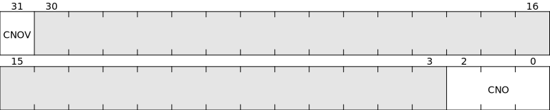
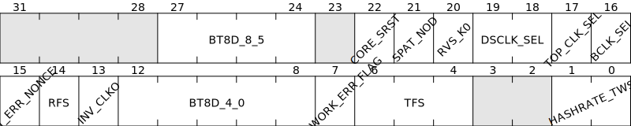
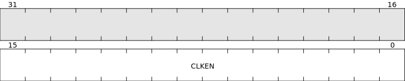
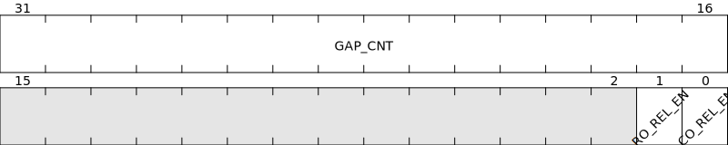
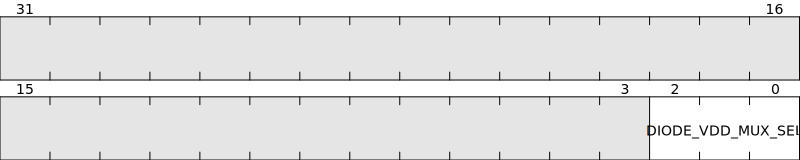
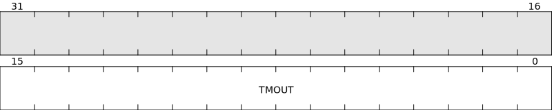
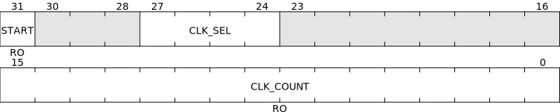

# BM1397 Registers map

## Chip Address

Address = 0x00

Reset value = 0x13971800


### CHIP_ID

On BM1397, CHIP_ID = 0x1397

### CORE_NUM

On BM1397, CORE_NUM = 0x18 which should be multiplied by 28, to find the actual Core Number : 672.

### ADDR

This is the Chip Address of the particular chip, see [Set Chip Address](bm1366_protocol.md#set-chip-address) for details.

## Hash Rate

Address = 0x04

Reset value = 0x80000000


### HASHRATE

Hash rate value in 2^24 unit.

## PLL0 Parameter

Address = 0x08

Reset value = 0xC0600161


PLL0 is used as base clock for hash rate calculation.

PLL0 frequency is calculated with the formula :

`
fPLL0 = fCLKI * FBDIV / (REFDIV * POSTDIV1 * POSTDIV2)
`

POSTDIV1 must be greater than or equal to POSTDIV2.

## Chip Nonce Offset

Address = 0x0C

Reset value = 0x00000000



## Hash Counting Number

Address = 0x10

Reset value = 0x00000000


## Ticket Mask

Address = 0x14

Reset value = 0x00000000


The chip will provide only solutions that are <= target based on this difficulty.

TICKET_MASK is bitmask that is used to mask the bits of bytes 0..31 of the reversed SHA hash.

Chip sends the nonce only if
   ```revhash[0..3] == 0 && (revhash[4..7] & reverse_bytes ticket_mask)) == 0```

The weird mask format came about probably because they did comparison on bit-reversed SHA hash, not just byte-reversed SHA hash.

## Misc Control

Address = 0x18

Reset value = 0x00003A01



### BT8D

It is a 9-bit divider to determine actual Baudrate. It is composed by BT8D_8_5 and BT8D_4_0.

### BCLK_SEL
<!-- cspell:disable-next-line -->
**B**audrate **CL**oc**K** **SEL**ect

* BCLK_SEL = 0: Baudrate base clock is CLKI (external clock)
* BCLK_SEL = 1: Baudrate base clock is PLL3

### RFS (RF pin Selector)

* RFS = 0: Open Drain
* RFS = 1: SDA0

### TFS (TF pin Selector)

* TFS = 0: Hash Doing
* TFS = 1: UART RX
* TFS = 2: UART TX
* TFS = 3: SCL0

## I2C Control

Address = 0x1C

Reset value = 0x01000000


## Ordered Clock Enable

Address = 0x20

Reset value = 0x0000FFFF



## Fast UART Configuration

Address = 0x28

Reset value = 0x0600000F


## UART Relay

Address = 0x2C

Reset value = 0x000F0000



## Ticket Mask2

Address = 0x38

Reset value = 0x00000000


## Core Register Control

Address = 0x3C

Reset value = 0x00004000


Reverse engineering on this register is still ongoing.

### RD#_WR

* RD#_WR = 0: Read operation on Core Register. [CORE_REG_VAL](#core_reg_val) must be = 0xFF.
* RD#_WR = 1: Write operation on Core Register. [CORE_REG_VAL](#core_reg_val) must contain the value we want to write into the Core Register.

### CORE_ID

Note: in T17 FW, this CORE_ID value is actually the wanted Core ID divided by 2 (at least when doing check_clock_counter() function).

### CORE_REG_ID

Identifier of the Core Register.

### CORE_REG_VAL

Value of the Core Register with ID = [CORE_REG_ID](#core_reg_id)

## Core Register Value

Address = 0x40

Reset value = 0x00000000


Reverse engineering on this register is still ongoing.

## External Temperature Sensor Read

Address = 0x44

Reset value = 0x00000100


## Error Flag

Address = 0x48

Reset value = 0xFF000000


## Nonce Error Counter

Address = 0x4C

Reset value = 0x00000000


## Nonce Overflow Counter

Address = 0x50

Reset value = 0x00000000


## Analog Mux Control

Address = 0x54

Reset value = 0x00000000



## Io Driver Strength Configuration

Address = 0x58

Reset value = 0x02112111


## Time Out

Address = 0x5C

Reset value = 0x0000FFFF



## PLL1 Parameter

Address = 0x60

Reset value = 0x00640111


PLL1 frequency is calculated with the formula :

`
fPLL1 = fCLKI * FBDIV / (REFDIV * POSTDIV1 * POSTDIV2)
`
POSTDIV1 must be greater than or equal to POSTDIV2.

## PLL2 Parameter

Address = 0x64

Reset value = 0x00680111


PLL2 frequency is calculated with the formula :

`
fPLL2 = fCLKI * FBDIV / (REFDIV * POSTDIV1 * POSTDIV2)
`
POSTDIV1 must be greater than or equal to POSTDIV2.

## PLL3 Parameter

Address = 0x68

Reset value = 0x00700111


PLL3 is used as a base clock for baud rate generation with baud rate higher than 3.125 MHz (see [Set Baudrate](protocol.md#set-baudrate)).

PLL3 frequency is calculated with the formula :

`
fPLL3 = fCLKI * FBDIV / (REFDIV * POSTDIV1 * POSTDIV2)
`
POSTDIV1 must be greater than or equal to POSTDIV2.

## Ordered Clock Monitor

Address = 0x6C

Reset value = 0x00000000



## PLL0 Divider

Address = 0x70

Reset value = 0x03040607


### PLLDIV3/2/1

in T17 FW, written to 0xF and seems to not affect ASIC frequency.

### PLLDIV0

in T17 FW, is called "user divider", set to 0 by default and divide by 1 the ASIC frequency.

## PLL1 Divider

Address = 0x74

Reset value = 0x03040506


## PLL2 Divider

Address = 0x78

Reset value = 0x03040506


## PLL3 Divider

Address = 0x7C

Reset value = 0x03040506


## Clock Order Control0

Address = 0x80

Reset value = 0xD95C8410


## Clock Order Control1

Address = 0x84

Reset value = 0xFB73EA62


## Clock Order Status

Address = 0x8C

Reset value = 0x00000000


## Frequency Sweep Control1

Address = 0x90

Reset value = 0x00000070


## Golden Nonce For Sweep Return

Address = 0x94

Reset value = 0x00376400


## Returned Group Pattern Status

Address = 0x98

Reset value = 0x30303030


## Nonce Returned Timeout

Address = 0x9C

Reset value = 0x0000FFFF


## Returned Single Pattern Status

Address = 0xA0

Reset value = 0x00000000


